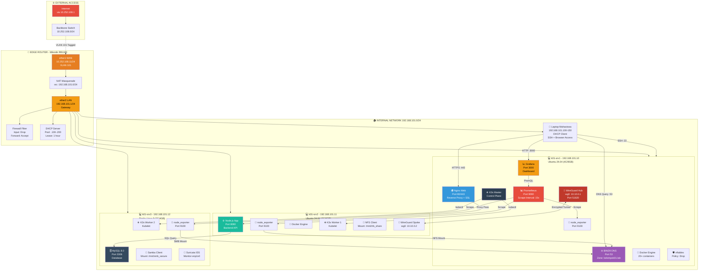
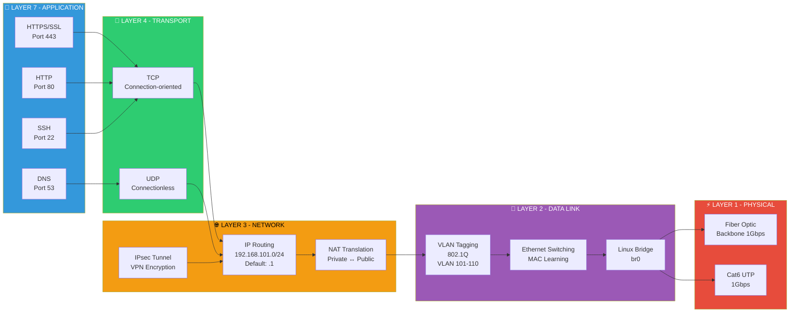
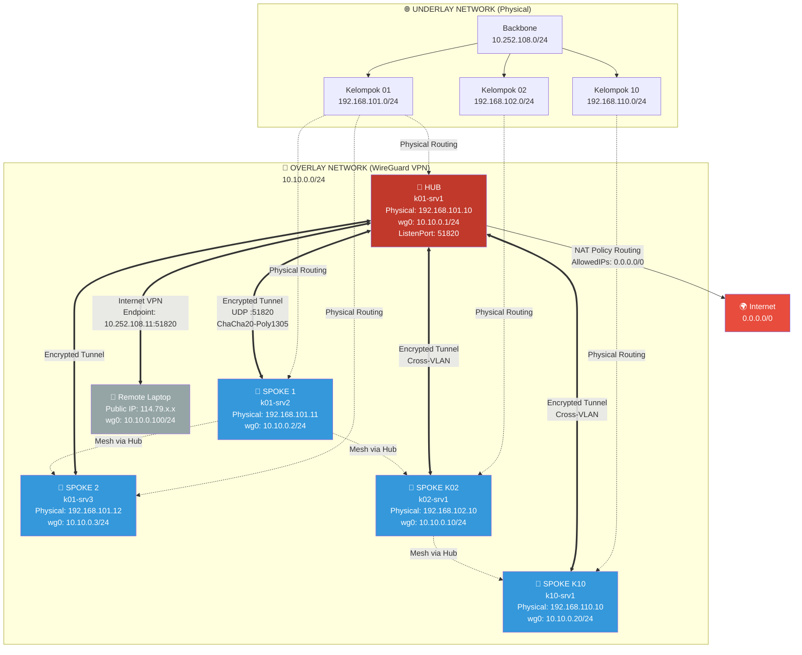
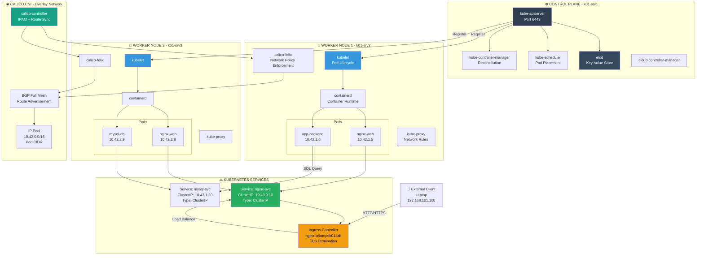
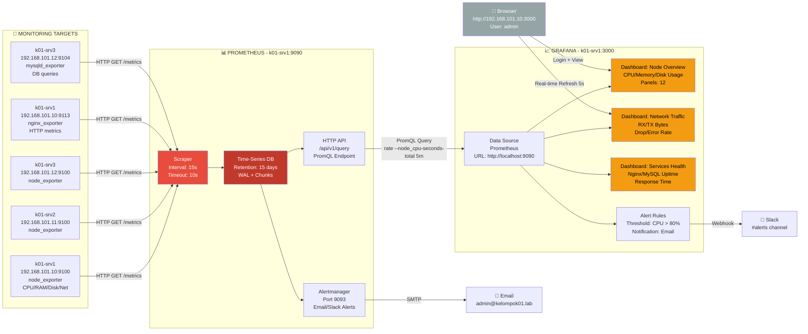
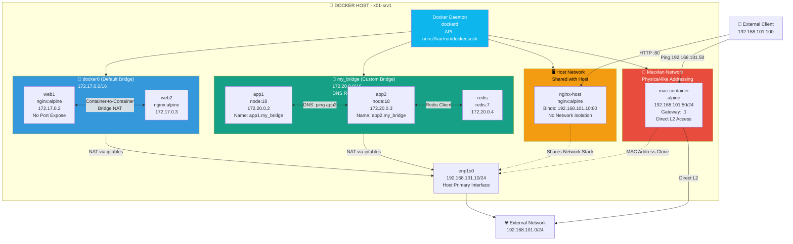
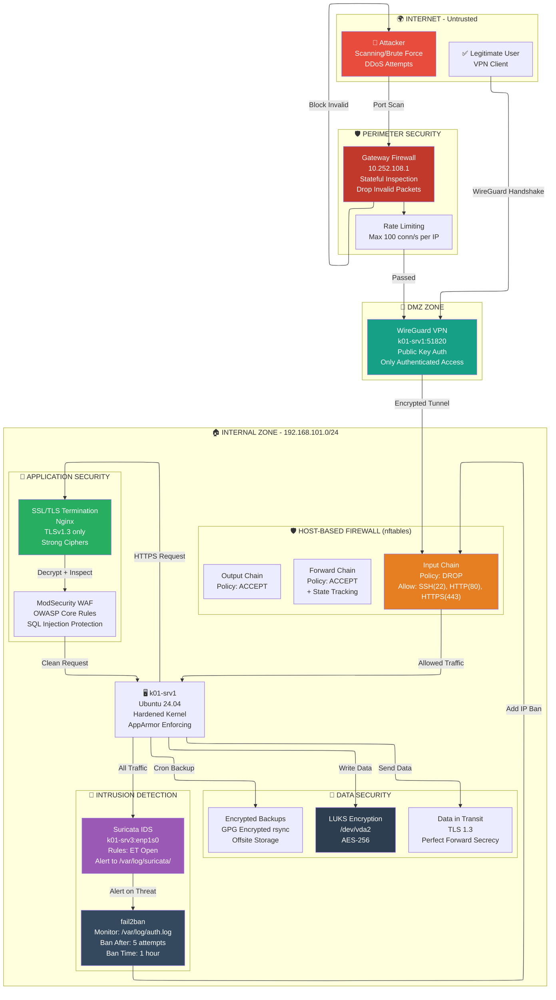
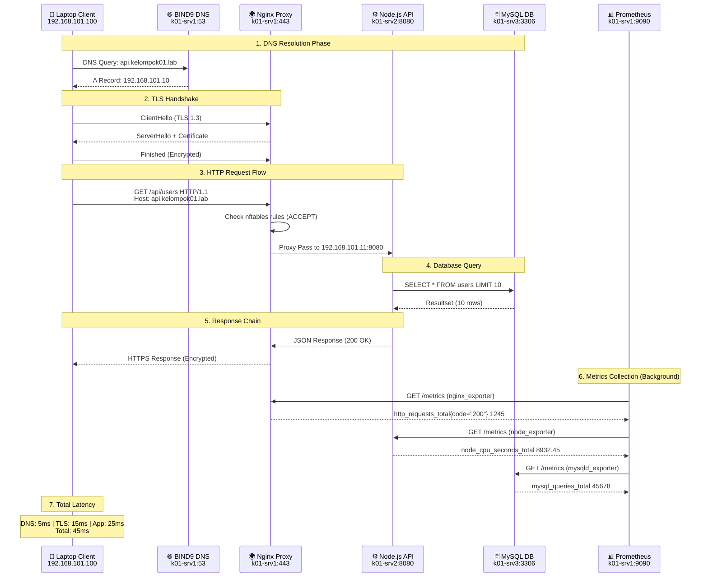

---

## 📊 Network Topology

# TOPOLOGI JARINGAN LAB - DIAGRAM MERMAID
## WORKSHOP ADMINISTRASI JARINGAN PENS 2026

## 1. TOPOLOGI INFRASTRUKTUR LENGKAP LAB

```mermaid
graph TB
    subgraph Internet["🌐 INTERNET"]
        WAN[Public Internet<br/>ISP Gateway]
    end

    subgraph Backbone["🏢 BACKBONE NETWORK<br/>10.252.108.0/24"]
        GW[🔴 Gateway Router<br/>10.252.108.1<br/>NAT + Firewall]
        CORE_SW[⚡ Core Switch<br/>Mikrotik 24-port<br/>10.252.108.2<br/>VLAN 101-110]

        subgraph Management["Management Zone"]
            PROX[🖥️ Proxmox VE<br/>10.252.108.10<br/>Xeon 40C / 64GB RAM<br/>Hypervisor]
            MON[📊 Monitoring Server<br/>10.252.108.100<br/>Prometheus + Grafana]
            DNS_MAIN[🌐 DNS Lab Main<br/>10.252.108.53<br/>lab.pens.ac.id]
            NTP_MAIN[⏰ NTP Stratum 1<br/>10.252.108.123]
        end
    end

    WAN -->|NAT Translation| GW
    GW <-->|Trunk VLAN All| CORE_SW
    CORE_SW --> PROX
    CORE_SW --> MON
    CORE_SW --> DNS_MAIN
    CORE_SW --> NTP_MAIN

    subgraph K01["👥 KELOMPOK 01<br/>VLAN 101 - 192.168.101.0/24"]
        RB01[🔶 Mikrotik RB1100<br/>WAN: 10.252.108.11<br/>LAN: 192.168.101.1/24<br/>Gateway + DHCP Server]

        subgraph VMs01["Virtual Machines (Proxmox)"]
            VM01_1[💻 k01-srv1<br/>192.168.101.10<br/>Ubuntu 24.04 LTS<br/>4C/8GB - Primary Services]
            VM01_2[💻 k01-srv2<br/>192.168.101.11<br/>Ubuntu 24.04 LTS<br/>2C/4GB - Backend App]
            VM01_3[💻 k01-srv3<br/>192.168.101.12<br/>Rocky Linux 9<br/>2C/4GB - Database]
        end

        LAPTOP01[💼 Laptop Mahasiswa<br/>192.168.101.100-150<br/>DHCP Dynamic]
    end

    subgraph K02["👥 KELOMPOK 02<br/>VLAN 102 - 192.168.102.0/24"]
        RB02[🔶 Mikrotik RB1100<br/>WAN: 10.252.108.12<br/>LAN: 192.168.102.1/24]

        VM02_1[💻 k02-srv1<br/>192.168.102.10]
        VM02_2[💻 k02-srv2<br/>192.168.102.11]
        VM02_3[💻 k02-srv3<br/>192.168.102.12]
        LAPTOP02[💼 Laptop k02<br/>DHCP]
    end

    subgraph K03["👥 KELOMPOK 03-09<br/>VLAN 103-109"]
        K03_09[🔶 RB1100 x7<br/>Similar topology<br/>192.168.103-109.0/24]
    end

    subgraph K10["👥 KELOMPOK 10<br/>VLAN 110 - 192.168.110.0/24"]
        RB10[🔶 Mikrotik RB1100<br/>WAN: 10.252.108.20<br/>LAN: 192.168.110.1/24]

        VM10_1[💻 k10-srv1<br/>192.168.110.10]
        VM10_2[💻 k10-srv2<br/>192.168.110.11]
        VM10_3[💻 k10-srv3<br/>192.168.110.12]
        LAPTOP10[💼 Laptop k10<br/>DHCP]
    end

    CORE_SW -.VLAN 101.-> RB01
    CORE_SW -.VLAN 102.-> RB02
    CORE_SW -.VLAN 103-109.-> K03_09
    CORE_SW -.VLAN 110.-> RB10

    PROX ==>|VM Hosting| VM01_1
    PROX ==>|VM Hosting| VM01_2
    PROX ==>|VM Hosting| VM01_3
    PROX ==>|VM Hosting| VM02_1
    PROX ==>|VM Hosting| VM10_1

    RB01 --> VM01_1
    RB01 --> VM01_2
    RB01 --> VM01_3
    RB01 --> LAPTOP01

    RB02 --> VM02_1
    RB02 --> VM02_2
    RB02 --> VM02_3
    RB02 --> LAPTOP02

    RB10 --> VM10_1
    RB10 --> VM10_2
    RB10 --> VM10_3
    RB10 --> LAPTOP10

    style WAN fill:#e74c3c,color:#fff
    style GW fill:#c0392b,color:#fff
    style CORE_SW fill:#16a085,color:#fff
    style PROX fill:#2980b9,color:#fff
    style MON fill:#27ae60,color:#fff
    style DNS_MAIN fill:#8e44ad,color:#fff
    style NTP_MAIN fill:#d35400,color:#fff
    style RB01 fill:#f39c12,color:#000
    style RB02 fill:#f39c12,color:#000
    style RB10 fill:#f39c12,color:#000
    style VM01_1 fill:#3498db,color:#fff
    style VM01_2 fill:#3498db,color:#fff
    style VM01_3 fill:#e67e22,color:#fff
```



---

## 2. TOPOLOGI DETAIL KELOMPOK 01 (Representatif Semua Kelompok)



---

## 3. TOPOLOGI SERVICES ARCHITECTURE (Layer View)



---

## 4. TOPOLOGI WIREGUARD VPN OVERLAY (SDN)



---

## 5. TOPOLOGI KUBERNETES CLUSTER (K3s)



---

## 6. TOPOLOGI MONITORING STACK (Prometheus + Grafana)


---

## 7. TOPOLOGI DOCKER NETWORKING (Multi-Mode)



---

## 8. TOPOLOGI SECURITY LAYERS (Defense in Depth)



---

## 9. TOPOLOGI DATA FLOW (End-to-End Request)



---


## LEGENDA WARNA & ICON

| Warna Hex | Komponen | Emoji |
|-----------|----------|-------|
| `#e74c3c` (Red) | Internet, Critical, Firewall | 🔴 🌍 |
| `#c0392b` (Dark Red) | Gateway, Security Hub | 🛡️ |
| `#f39c12` (Orange) | Infrastructure, Router, Warning | 🔶 ⚡ |
| `#3498db` (Blue) | Servers, Workers, Pods | 💻 🔵 |
| `#2c3e50` (Dark Blue) | Control Plane, Master | ☸️ |
| `#16a085` (Teal) | Network Services, Switches | 🌐 |
| `#27ae60` (Green) | Monitoring, Success | 📊 ✅ |
| `#9b59b6` (Purple) | DNS, Database | 🌐 🗄️ |
| `#95a5a6` (Gray) | Client Devices, Laptop | 💼 |
| `#34495e` (Charcoal) | Security Tools | 🚨 |


---

## 📝 Penilaian (Total 100%)

| Komponen | Bobot | Keterangan |
|----------|-------|------------|
| Kehadiran & Partisipasi | 10% | Min 75% hadir |
| Tugas Praktikum | 30% | Lab report mingguan |
| Quiz & UTS | 25% | Teori + praktik |
| Project Akhir | 25% | Infrastruktur lengkap |
| UAS Praktik | 10% | Troubleshooting |

---

## 🚀 Quick Start

```bash
# Clone repository
git clone https://github.com/[username]/praktikum-admin-jaringan-2026.git
cd praktikum-admin-jaringan-2026

# Baca modul Minggu 1
cat MINGGU_1_PRAKTIKUM_LENGKAP.md

# Akses Proxmox (ganti XX dengan nomor kelompok)
https://10.252.108.10:8006
User: kelompokXX@pve

# SSH ke VM
ssh adminXX@192.168.1XX.10
