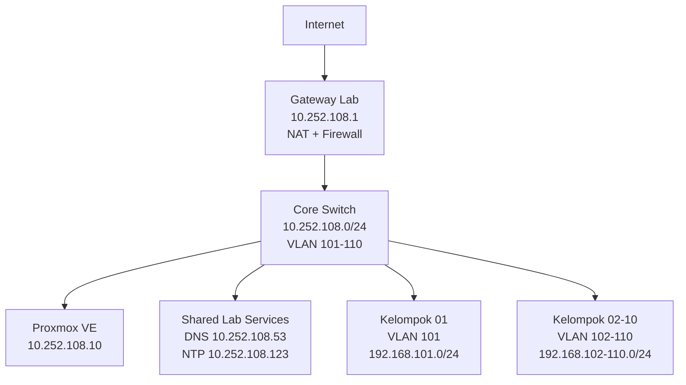
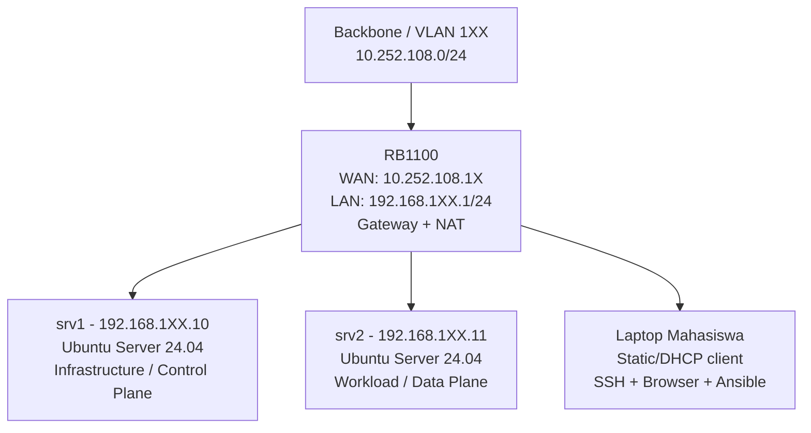
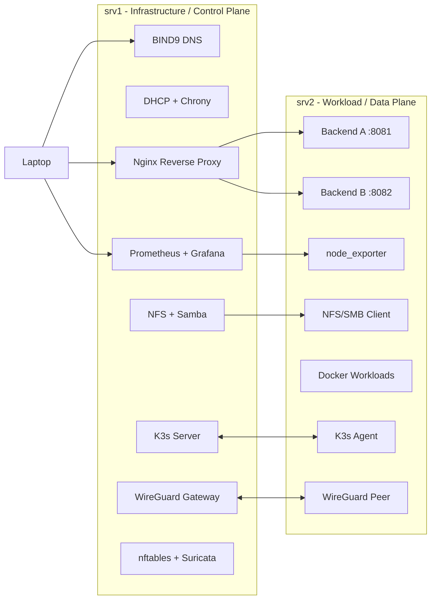
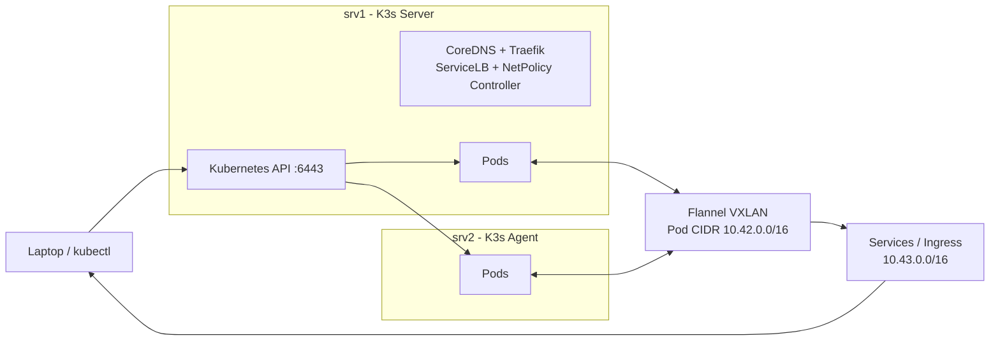
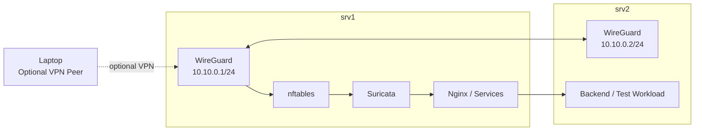

# TOPOLOGI JARINGAN LAB - VERSI SEDERHANA
## Workshop Administrasi Jaringan PENS 2026

Dokumen ini menjadi baseline topologi untuk seluruh praktikum. Desain sengaja dibuat sederhana agar mahasiswa fokus pada administrasi jaringan dan integrasi layanan, bukan pada banyaknya node.

## Prinsip Desain

- 10 kelompok tetap dipisahkan menggunakan VLAN 101-110.
- Setiap kelompok menggunakan **1 router + 2 VM + laptop mahasiswa**.
- RB1100 berfungsi sebagai **gateway/NAT**. DHCP praktikum dijalankan di `srv1` mulai Minggu 4.
- `srv1` adalah node **infrastruktur/control-plane**.
- `srv2` adalah node **workload/data-plane** sekaligus target pengujian.
- Service yang membutuhkan lebih dari satu instance, seperti load balancing, disimulasikan dengan **dua proses/container pada srv2**, bukan VM tambahan.
- Kubernetes menggunakan **K3s 2-node** dengan CNI bawaan Flannel.
- WireGuard menggunakan tunnel **srv1 <-> srv2**; laptop dapat ditambahkan sebagai peer opsional pada minggu security.

---

## 1. Topologi Infrastruktur Lab

```mermaid
flowchart TB
    INET[Internet]
    GW[Gateway Lab\n10.252.108.1\nNAT + Firewall]
    SW[Core Switch\n10.252.108.0/24\nVLAN 101-110]
    PROX[Proxmox VE\n10.252.108.10]
    UPSTREAM[Shared Lab Services\nDNS 10.252.108.53\nNTP 10.252.108.123]

    K01[Kelompok 01\nVLAN 101\n192.168.101.0/24]
    K02_10[Kelompok 02-10\nVLAN 102-110\n192.168.102-110.0/24]

    INET --> GW --> SW
    SW --> PROX
    SW --> UPSTREAM
    SW --> K01
    SW --> K02_10
```

Semua kelompok menggunakan pola yang sama. Diagram berikut menggunakan Kelompok 01 sebagai contoh.

---

## 2. Topologi Per Kelompok

```mermaid
flowchart TB
    BB[Backbone / VLAN 1XX\n10.252.108.0/24]
    R[RB1100\nWAN: 10.252.108.1X\nLAN: 192.168.1XX.1/24\nGateway + NAT]

    S1[srv1 - 192.168.1XX.10\nUbuntu Server 24.04\nInfrastructure / Control Plane]
    S2[srv2 - 192.168.1XX.11\nUbuntu Server 24.04\nWorkload / Data Plane]
    LAP[Laptop Mahasiswa\nStatic/DHCP client\nSSH + Browser + Ansible]

    BB --> R
    R --> S1
    R --> S2
    R --> LAP
```

### IP Plan

| Komponen | Alamat | Fungsi |
|---|---|---|
| RB1100 LAN | `192.168.1XX.1/24` | Default gateway |
| srv1 | `192.168.1XX.10/24` | Infrastruktur/control-plane |
| srv2 | `192.168.1XX.11/24` | Workload/data-plane |
| Laptop | `192.168.1XX.100-199` | Client; DHCP pool mulai Minggu 4 |
| WireGuard | `10.10.0.0/24` | Overlay praktikum |
| K3s Pod CIDR | `10.42.0.0/16` | Pod network |
| K3s Service CIDR | `10.43.0.0/16` | Cluster service network |

`XX` adalah nomor kelompok dua digit. Contoh Kelompok 01 menggunakan subnet `192.168.101.0/24`.

---

## 3. Penempatan Layanan

```mermaid
flowchart LR
    LAP[Laptop]

    subgraph S1[srv1 - Infrastructure / Control Plane]
        DNS[BIND9 DNS]
        DHCP[DHCP + Chrony]
        NGINX[Nginx Reverse Proxy]
        FILE[NFS + Samba]
        MON[Prometheus + Grafana]
        K3S1[K3s Server]
        WG1[WireGuard Gateway]
        SEC[nftables + Suricata]
    end

    subgraph S2[srv2 - Workload / Data Plane]
        APP1[Backend A :8081]
        APP2[Backend B :8082]
        EXP[node_exporter]
        CLIENT[NFS/SMB Client]
        DOCKER[Docker Workloads]
        K3S2[K3s Agent]
        WG2[WireGuard Peer]
    end

    LAP --> DNS
    LAP --> NGINX
    LAP --> MON
    NGINX --> APP1
    NGINX --> APP2
    MON --> EXP
    FILE --> CLIENT
    K3S1 <--> K3S2
    WG1 <--> WG2
```

Pembagian ini bukan desain production, tetapi **desain teaching lab**. Tujuannya adalah meminimalkan VM sambil tetap memberi dua host Linux agar konsep client/server, automation, monitoring, cluster, VPN, dan troubleshooting tetap dapat diuji.

---

## 4. Kubernetes K3s 2-Node

```mermaid
flowchart LR
    LAP[Laptop / kubectl]

    subgraph MASTER[srv1 - K3s Server]
        API[Kubernetes API :6443]
        CORE[CoreDNS + Traefik\nServiceLB + NetPolicy Controller]
        POD1[Pods]
    end

    subgraph WORKER[srv2 - K3s Agent]
        POD2[Pods]
    end

    FLANNEL[Flannel VXLAN\nPod CIDR 10.42.0.0/16]
    SVC[Services / Ingress\n10.43.0.0/16]

    LAP --> API
    API --> POD1
    API --> POD2
    POD1 <--> FLANNEL
    POD2 <--> FLANNEL
    FLANNEL --> SVC
    SVC --> LAP
```

K3s menggunakan komponen networking bawaan agar mahasiswa tidak perlu memasang CNI tambahan hanya untuk membangun lab dasar. Custom CNI dapat diberikan sebagai materi pengayaan.

---

## 5. WireGuard dan Security Flow

```mermaid
flowchart LR
    LAP[Laptop\nOptional VPN Peer]

    subgraph S1[srv1]
        WG1[WireGuard\n10.10.0.1/24]
        NFT[nftables]
        IDS[Suricata]
        PROXY[Nginx / Services]
    end

    subgraph S2[srv2]
        WG2[WireGuard\n10.10.0.2/24]
        APP[Backend / Test Workload]
    end

    LAP -. optional VPN .-> WG1
    WG1 <--> WG2
    WG1 --> NFT --> IDS --> PROXY
    PROXY --> APP
```

Pada Minggu 12 cukup dibangun tunnel `srv1 <-> srv2`. Pada Minggu 13 laptop dapat ditambahkan sebagai peer ketiga untuk demonstrasi remote access dan policy enforcement.

---

## Ringkasan Resource per Kelompok

| Resource | Sebelumnya | Baseline Sederhana |
|---|---:|---:|
| Router | 1 | 1 |
| VM | 3 | **2** |
| Laptop | 1+ | 1+ |
| Kubernetes node | 3 | **2** |
| WireGuard node wajib | 3 | **2** |
| Backend load balancer | 2 VM | **2 proses/container pada srv2** |

Dengan 10 kelompok, kebutuhan VM turun dari **30 VM menjadi 20 VM**, sehingga penggunaan CPU/RAM Proxmox dan beban troubleshooting infrastruktur lebih rendah tanpa menghapus kompetensi utama praktikum.
